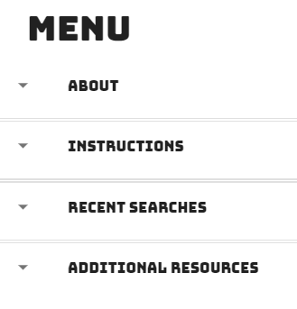
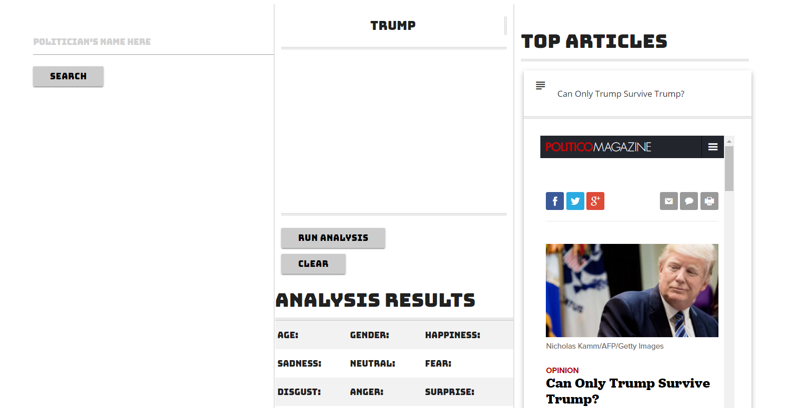
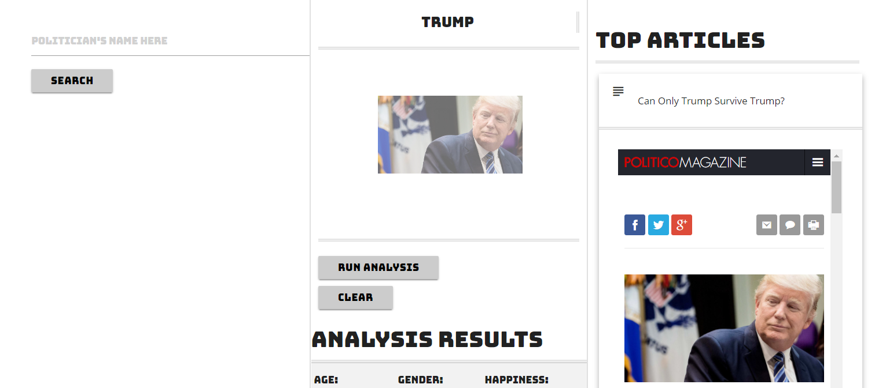
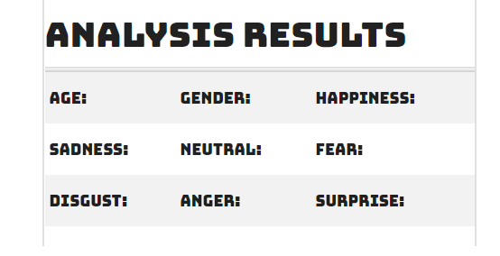
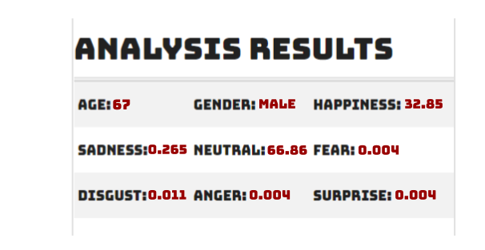
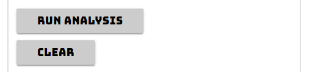

**Polimotions** believes that it's time for news to not only be trustworthy and informative, but also fun and interactive.

You can test our most recent update [here](https://tmiess.github.io/Polimotions/).

# Jump To

- [Introduction](#introduction)
- [Features](#features)
  - [Search](#search)
  - [Browse Articles](#browse-articles)
  - [Drag and Drop](#drag-and-drop)
  - [Analyze](#analyze)
- [Tools](#tools)
- [Authors](#authors)

# Introduction
FInally, a fun and easy way to learn more about the current political climate! Polimotions harnesses the power of News API, Bing Search and FacePlusPlus Facial Detection to bring you accurate, up-to-date political information you can trust.

Users can read instructions, learn how the app was made, see recent searches, and view reliable news sources by clicking the hamburger menu button.

# Features
### Search
Simply type in the name of a politician and watch as the magic unfolds.

### Browse Articles
Polimotions delivers trending aticles from Politico.com right to your fingertips.

### Drag and Drop

Inside the articles, you will find pictures of the politician(s) you are interested in.

Drag and drop the image of your choice into the drop zone in the middle of the page.

### Analyze
Putting a fun twist on a usually mundane task, Polimotions uses *FacePlusPlus Facial Detection* technology to deliver an emotional analysis of your searched politician.

By hitting the *Run Analysis* button, you will see the results. As of now, results include estimates of age, gender, happiness, sadness, neutrality, fear, disgust, anger, and surprise.

When you want Polimotions to perform a new analysis, just press the *clear* button and drag and drop a new image into the drop zone.

# Tools
# Authors

